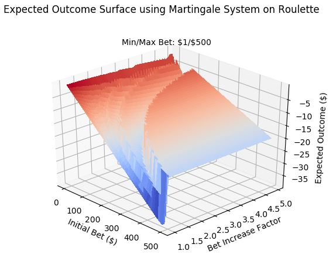

# Martingale Betting System Expected Outcomes
A common gambling strategy is known as the Martingale System (https://en.wikipedia.org/wiki/Martingale_(betting_system)).
I was curious what the expected outcomes were of using it in Roulette, so I calculated them and I plot them here in a 3d plot.

## Getting Started

### Prerequisites
Numpy, matplotlib

### How to Run
Simply run the main.py file to generate the plot.  Feel free to modify the initial bet and bet increase factor (b0 and f) ranges as well as
the max and min bet amounts.

The monteCarloRouletteSim.py file was used to validate the results of the main.py script.

## Results
The results are included here for convenience.

## Authors

* **Adam Lewis** - *Initial work* 

## License

This project is licensed under the MIT License - see the [LICENSE.md](LICENSE.md) file for details

## Acknowledgments

* Hat tip to anyone whose code was used
* Inspiration
* etc

